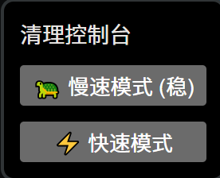

# YouTube 批量取消点赞助手

一键批量取消 YouTube 点赞视频的 Tampermonkey 用户脚本。

## 功能

在 YouTube 点赞视频列表页 (`https://www.youtube.com/playlist?list=LL`) 注入一个浮动的清理控制面板，自动逐条移除所有已点赞的视频。

- **🐢 慢速模式** — 间隔 3 秒，更稳定，适合网络较慢或大量视频
- **⚡ 快速模式** — 间隔 1.5 秒，适合快速清理
- 自动滚动加载更多视频
- 支持中文 / English / 日本語 界面

## 安装

### 方式一：Tampermonkey 脚本（推荐）

1. 安装 [Tampermonkey](https://www.tampermonkey.net/) 浏览器扩展
2. [点击安装脚本](https://github.com/SakuraLoveForever/youtube_unlike_delete_script/raw/main/YouTube%20%E6%89%B9%E9%87%8F%E5%8F%96%E6%B6%88%E7%82%B9%E8%B5%9E%E5%8A%A9%E6%89%8B%20(%E7%B2%BE%E5%87%86%E7%89%88)-1.0.user.js)
3. 打开 [YouTube 点赞页面](https://www.youtube.com/playlist?list=LL)，左上角会出现控制面板

### 方式二：控制台脚本

1. 打开 [YouTube 点赞页面](https://www.youtube.com/playlist?list=LL)
2. 按 `F12` 打开开发者工具，切换到 Console 标签
3. 复制 `youtube删除所有点赞.txt` 中的全部代码，粘贴并回车运行

## 使用

点击控制面板中的按钮即可开始清理。清理过程中请保持页面打开，不要切换标签页。

## 许可

MIT License
